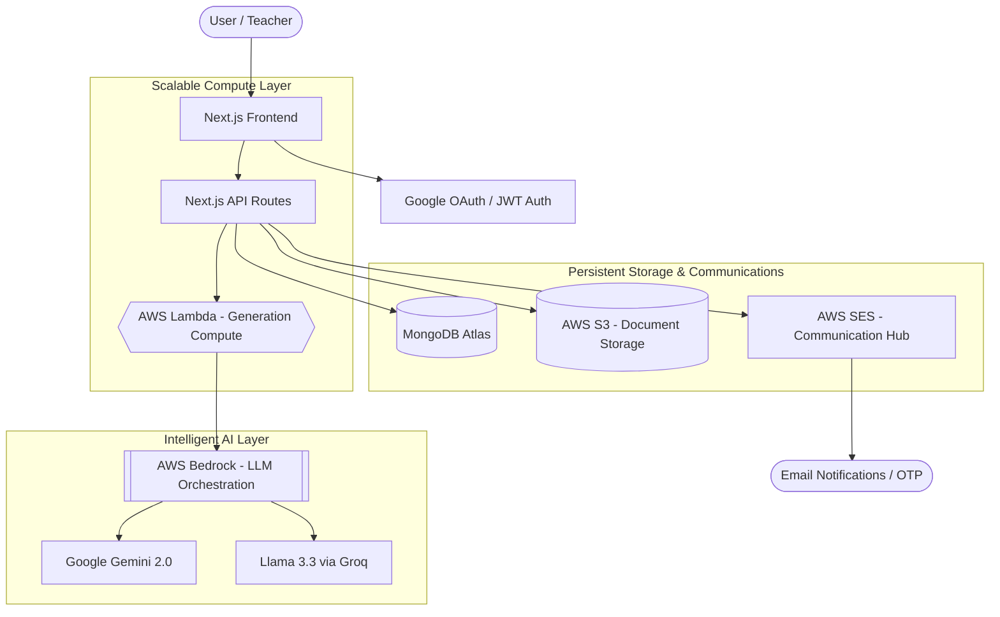

#  Quiz Central - Cloud-Native AI Quiz Intelligence System

[](https://nextjs.org/)
[](https://aws.amazon.com/)
[](https://www.mongodb.com/)
[](LICENSE)

**Quiz Central** is an enterprise-grade education platform that transforms static study materials into dynamic, AI-powered learning experiences. Built with a cloud-first philosophy, it leverages Amazon Web Services (AWS) to provide a scalable, secure, and intelligent environment for both educators and students.

---

##  System Architecture

Quiz Central is built on a highly available and distributed architecture, ensuring low latency and high scalability across all modules.



---

##  Cloud Stack & Core Components

This project is meticulously designed to demonstrate high-performance cloud integration:

###  [AWS S3](https://aws.amazon.com/s3/) - Secure Object Storage
- **Purpose**: Acts as the centralized repository for all student and teacher uploaded documents.
- **Implementation**: Utilizes **Pre-signed URLs** for secure, temporary access to private content, reducing server load and enhancing security.
- **Capabilities**: Handles large PDF/DOCX study materials with automated metadata tagging.

### [AWS Bedrock](https://aws.amazon.com/bedrock/) - Foundation Model Hub
- **Purpose**: Powers the Generative AI engine that transforms PDFs into high-quality MCQs.
- **Implementation**: Provides a unified API to access state-of-the-art models (like Llama and Titan), enabling complex reasoning and difficulty-aware question generation.
- **Scalability**: Decouples the frontend from specific AI vendors, allowing for seamless model switching and optimization.

###  [AWS Lambda](https://aws.amazon.com/lambda/) - Serverless Scalability
- **Purpose**: Executes heavy-duty compute tasks such as document parsing and AI response validation.
- **Benefit**: Ensures the main web application remains responsive by offloading long-running generative tasks to a serverless environment that scales horizontally with demand.

###  [AWS SES](https://aws.amazon.com/ses/) - Transactional Email
- **Purpose**: Manages the critical communication loop, including One-Time Passwords (OTP) and password reset notifications.
- **Reliability**: Leverages Amazon's high-deliverability infrastructure to ensure academic credentials are never lost.

---

##  Key Features

- **AI Quiz Generation**: Upload any document and get a fully formatted, difficulty-balanced quiz in seconds.
- **Real-time Analytics**: Detailed performance metrics for students and comprehensive class-wide statistics for teachers.
- **Leaderboards**: Gamified learning environment to boost student engagement.
- **Security First**: Encrypted document storage, secure session management, and robust verification flows.
- **Fully Responsive**: A seamless experience across mobile, tablet, and desktop.

---

## Getting Started

### Prerequisites
- Node.js 20+
- MongoDB Atlas instance
- AWS Account (IAM user with S3, SES, and Bedrock permissions)

### Environment Setup
Create a `.env.local` file with the following variables:

```env
# Database
MONGODB_URI=your_mongodb_uri
JWT_SECRET=your_jwt_secret

# AWS Configuration
AWS_ACCESS_KEY_ID=your_access_key
AWS_SECRET_ACCESS_KEY=your_secret_key
AWS_REGION=us-east-1
AWS_S3_BUCKET_NAME=your_bucket_name
SES_FROM_EMAIL=your_verified_email

# AI Services
GEMINI_API_KEYS=key1,key2
GROQ_API_KEY=your_groq_key
```

### Installation
```bash
# Install dependencies
npm install

# Run the development server
npm run dev
```

---

## Presentation Note for Faculty
This project was built to showcase the power of **serverless architecture** and **cloud-native AI orchestration**. By utilizing AWS Lambda and S3, the application demonstrates how modern web tools can provide infinite scalability without the overhead of traditional server management. The integration of AWS Bedrock illustrates a future-proof approach to building GenAI applications.

---

Built with LOVE by [Ayush Sanjay Nirmal](https://github.com/AyushNirmal13)
